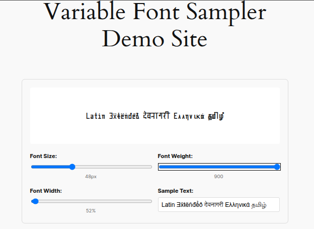

   

# Variable Font Sampler - 
### A WordPress plugin for font sampling using the fontsampler.js library


## [View Demo](https://fontsampler.atipra.in)

## Key Features:

1.  **Shortcode Support**: Use `[font_sampler]` with customizable parameters
    
2.  **Interactive Controls**: Sliders for font size, weight, width, and text input
    
3.  **Responsive Design**: Mobile-friendly interface
    
4.  **Variable Font Support**: Specifically designed for variable fonts with multiple axes
    

## Usage:

### Basic Shortcode:

```
[font_sampler font="https://example.com/font.woff2"]
```

### Advanced Shortcode:

```
[font_sampler font="https://example.com/font.woff2" text="Custom sample text" size="48" controls="true"]
```

## Installation Instructions:

1.  Go to your WordPress admin panel, go to Plugins > Add Plugin
2.  Search for Variable font sampler
3.  Look for this logo 
4.  Press install button
5.  Activate the plugin 
    

## Features of the Plugin:

    
*   **Variable Font Controls**: Interactive sliders for weight, width, and size
    
*   **Custom Text**: Users can change the sample text in real-time
    
*   **Error Handling**: Graceful fallbacks when fonts fail to load
    
*   **Responsive**: Works well on all device sizes
